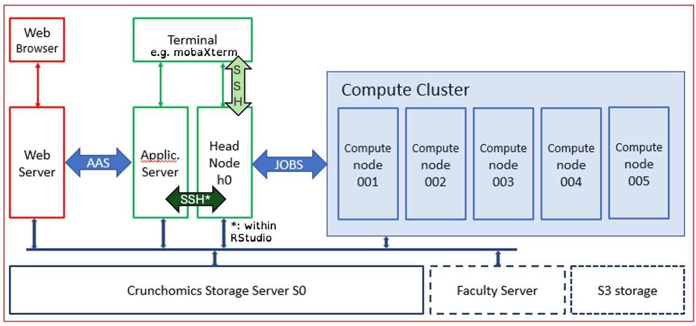

In this course, you will learn how to analyse sequencing data (both RNA-seq and genome sequencing). These kinds of datasets require specialized software to be processed, which are typically run on Linux servers. Therefore, we will make use of a **command-line interface (CLI)** on the Crunchomics compute cluster of the University of Amsterdam. Command-line interfaces are an alternative to graphical user interface, with which you are probably more familiar. The contents of this course are tailored to students who may have never used a command-line interface before. You need to take a few simple steps to connect to Crunchomics.

1) One software that is running on the Crunchomics server is RStudio, which you should be familiar with. To connect to the RStudio server, open an internet browser window (e.g. Google Chrome) and go to [https://omics-app01.science.uva.nl/](https://omics-app01.science.uva.nl/)

2) After signing on with your usual UvA password, you should see the familiar RStudio environment in your browser:


In the bottom-left panel, you see three tabs: Console, Terminal and Background Jobs. Click on Terminal to bring it to the foreground. 


3) In this terminal, type the following command. Replace `YOURSTUDENTNUMBER` with..... your student number :smiley:.

```bash
ssh YOURSTUDENTNUMBER@omics-h0.science.uva.nl
```

Now you are connected to the Crunchomics "headnode", where you can run all sorts of software. You will need to do these steps every time you sign into the headnode to run programs.

4) Again in the terminal, type the following two commands to properly initialize your account (you only need to run these commands once):

```bash
/zfs/omics/software/script/omics_install_script
```

and

```bash
/zfs/omics/software/script/omics_mv_rstudio_cache
```

That's it! You are now ready to start working on Crunchomics. Let's take a moment to recap what we did:



We used the red route on the left-hand side on this schematic to connect to the Crunchomics application server (via the blue "AAS" arrow). To reach the headnode (`h0`) we used a `ssh` (the dark green arrow) command on the terminal. You can also directly connect to the headnode by using an `ssh` connection from a command line on your local computer (`terminal` app for Mac users, `MobaXterm` or other options for Windows users). You can also see that both the application server and the headnode have access to the Crunchomics storage server. Finally, there are 5 'compute nodes' on Crunchomics; this is where large computations can be sent to via a job submission system (we will not use this system in this course, unfortunately!).

In the next episode we will learn the basics of navigating the filesystem on your Crunchomics account. We will do this on the command line only! 

