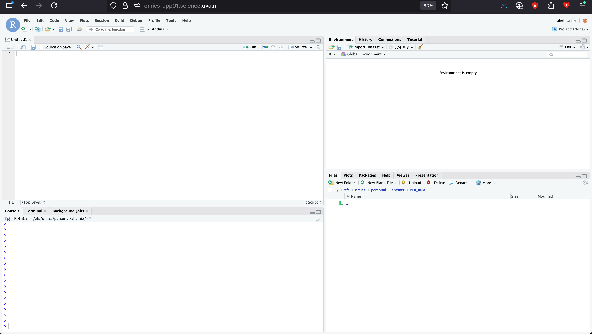
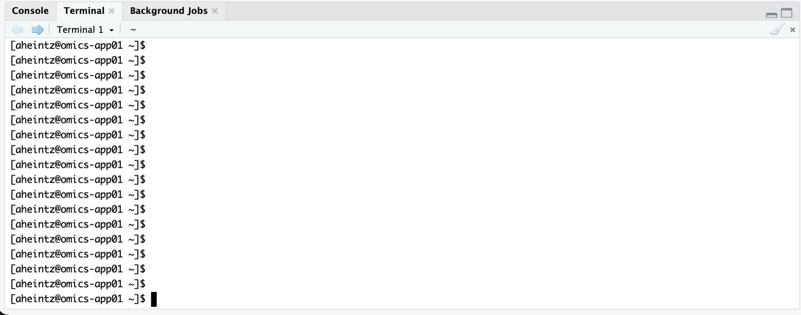

In this course, you will learn how to analyse sequencing data (both RNA-seq and genome sequencing). These kinds of datasets require specialized software to be processed, which are typically run on Linux servers. Therefore, we will make use of a command-line interface on the Crunchomics compute cluster of the University of Amsterdam. The contents of this course are tailored to students who may have never used a command-line interface before. You need to take a few simple steps to connect to Crunchomics.

Easy way (recommended if you are not planning on using Crunchomics or another server outside of this course):

1) One software that is running on the Crunchomics server is RStudio, which you should be familiar with. To connect to the RStudio server, open an internet browser window (e.g. Google Chrome) and go to [https://omics-app01.science.uva.nl/](https://omics-app01.science.uva.nl/)

2) After signing on with your usual UvA password, you should see the familiar RStudio environment in your browser:



In the bottom-left panel, you see three tabs: Console, Terminal and Background Jobs. Click on Terminal to bring it to the foreground. 



3) In this terminal, type the following command. Replace `YOURSTUDENTNUMBER` with..... your student number :smiley:.

```bash
ssh YOURSTUDENTNUMBER@omics-h0.science.uva.nl
```

Now you are connected to the crunchomics "headnode", where you can run all sorts of software. You will need to do these steps every time you sign into the headnode to run programs.

4) Again in the terminal, type the following two commands to properly initialize your account (you only need to run these commands once):

```bash
/zfs/omics/software/script/omics_install_script
```

and

```bash
/zfs/omics/software/script/omics_mv_rstudio_cache
```

That's it! You are now ready to start working on Crunchomics. 

TODO: add list of small achievements so far.
