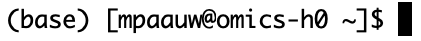

During the setup, you already ran some first commands. In this episode, we will learn a handful of very useful basic unix commands to navigate your filesystem, to move around files, and to inspect the content of files. If you're logged in to the head node, you should see something like this:



It shows your user name (`mpaauw`), the name of the node we are connected to (`omics-h0`), and after the `$` sign, a blinking cursor. That's where we will start typing commands to interact with the filesystem.

## `pwd`: Find out where we are

Let's orient ourselves by typing our first command, `pwd`, into the terminal, and pressing enter.

```bash
pwd
```

`pwd` prints the location of the current working directory and tells you where exactly you are in the file system. In my case, this prints `/home/mpaauw` as output. 

## `ls`: List the contents of a directory

Now that we know where we are, let's find out what files and folders exist in our home directory. For this, you can use the `ls` command, which lists the contents of the directory you are currently in:

```bash
ls
```

If you set-up you Crunchomics account correctly, you should see a folder called `personal`. That's where you can store up to 500GB of data on Crunchomics. Try adding the following modifier, or flag, to the `ls` command to change the output format:

## `cd`: Moving between directories

To be able to use the `personal` directory, we have to move in there. The command `cd` exists to do just that. Essentially, it's equivalent to clicking on a directory in the file navigation system on your own computer.

```bash
cd personal/
```
Let's verify that we actually ended up in this `personal` folder:

```bash
pwd
```

Should now print `/home/mpaauw/personal`.

You can move back 'up' in the hierarchy of directories by running:

```bash
cd ..
```

## `mkdir`: Make new folders

We can also make new folders. Let's navigate into `personal` again, and create a folder that will contain all the code and data for the Molecular Data Analysis module. We'll abbreviate it to `MDA`.

```bash
cd personal/

mkdir MDA
```

::: {.callout-caution collapse="false" title="Exercise"}
1. Verify that the `MDA` directory was created.
2. Navigate into it.
3. Verify that you are now working in the `MDA` directory.
4. Inspect the contents of the `MDA` directory.
5. Within `MDA`, create another directory, called `intro-to-cli`, and navigate into it.

```{bash}
#| eval: false
#| code-fold: true
#| code-summary: "Click me to see the answer"

# 1. Yes, I see the MDA folder now!
ls

# 2. Let's navigate into it
cd MDA/

# 3. This should print confirmation that you are now in MDA
pwd

# 4. This folder should be empty
ls

# 5. 
mkdir intro-to-cli
cd intro-to-cli/
```
:::

## `wget`: Download data

Next, let's download some sequencing data. We will use the `wget` command to download data from a repository, into the currect working directory. 

TODO: add wget command to github repo with some minimal sequencing data.

## `cp`" copying data

When doing bioinformatics projects, a clear folder structure is essential to keep yourself organized. We will copy the data to a new folder that we call `data`.

```bash
mkdir data

cp NAMEDATA.fastq data/

# Verify that it worked
ls -l
ls -l data
```

You should see that we now have two copies of the `.fastq` data. One file is in the working directory, and the other one is in the `data` folder. Notice that we added a flag, or option, to the `ls` command: `-l`. This specifies that the output is now presented in a list format. 

## `rm`: remove files and folders

We only need one copy of the data: let's remove the sequencing data that is now stored in our working directory with a new command `rm`.

```bash
rm NAMEDATA.fastq

# check if it worked
ls -l 
```

::: callout-important
**Unix does not have an undelete command, a trash can, or a bin**

This means that if you delete something with `rm`, it's **gone**. Therefore, use `rm` with care and check what you write twice before pressing enter!
:::

## `history`: keeping track of what you did

The `history` command is quite useful: it keeps a list of all the commands that you used today. You can view this as a simple automated labjournal, although it does not contain any output, or information whether a command worked at all. 

::: {.callout-caution collapse="false" title="Exercise"}
1. Remove the sequencing data from the `data` folder as well.
2. Use `history` to find back the command to download the data.
3. Redownload the data, and this time, move (`mv`) the data to the `data` folder.
4. Use `ls` commands to inspect what happened by using `mv` rather than `cp`.

```{bash}
#| eval: false
#| code-fold: true
#| code-summary: "Click me to see the answer"

# 1. Oh no, I removed my raw data!
rm data/FASTQ.fastq

# 2. Ah, I remember, it was the wget command.
history

# 3. Let's download again, and this time move it instead of copu
wget ....
mv data.fastq data/

# 4. Now we only have one copy of the data, in the data folder.
ls -l
ls -l data/
```
:::

Instead of retyping commands, you can also press the arrow 'up' key to cycle through commands you already ran before.

## TODO

- Exploring the contents of files (head, tail, cat)
- Exploring the size of files (wc -l)
- Piping: simple but powerful pipelines.


## Credits

Materials for this episode were strongly inspired by, and partly copied from, [Nina Dombrowski's 'Introduction to the cli' tutorial](https://ndombrowski.github.io/cli_workshop/source/bash_intro.html).