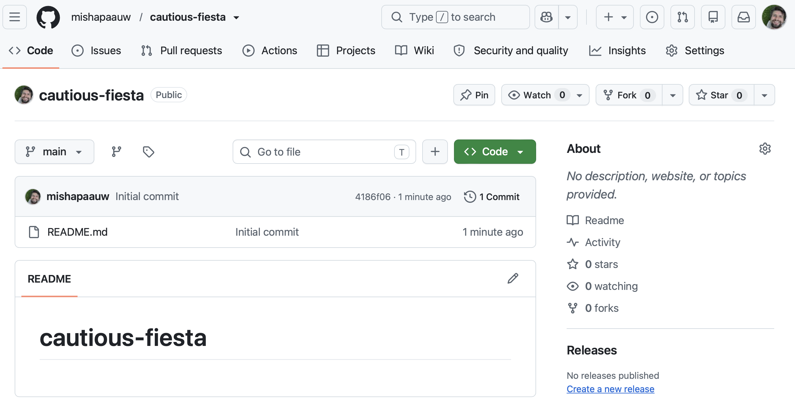

You may have heard of the **FAIR principle** for research data: Findable, Accessible, Interoperable, Reusable. These principles focus on how you manage your data, scripts, and results. Adhering to these principles makes tracking and sharing your work easier. You can imagine that a script sitting somewhere on your computer fails FAIR on nearly all aspects: nobody else can find it, access it, or reuse it: and a year from now, neither can you. `git` and `Github` address this directly. Putting the data and scripts of your analysis under 'version control' gives you a timestamped history of every change that you made. Pushing that history to `GitHub` makes it accessible for others.

Today we will setup a `GitHub` repository and push an analysis to it, from the cluster.

## Preparation

::: {.callout-note}
**Do this before the tutorial starts!**

You will need a GitHub account with 2 factor authentication setup.

1. Go to github.com → Sign up → follow the prompts
2. Make sure to set up 2 factor authentication using `Microsoft Authenticator`, `Google Authenticator`, SMS, or other options.
:::

## Examples of project repositories

Before making a small repository for today's tutorial, we will take a look at two scientific project repositories. Hopefully, these examples will give you an idea of *why* it's useful to maintain a (bioinformatics) repository. These two repositories were already introduced in the lecture corresponding to this tutorial, but are listed here again:

- [mishapaauw/PPPlasmids](https://github.com/mishapaauw/PPPlasmids){target="_blank"}: this repository is a work-in-progress bioinformatics project. All `scripts` and `results` are included in the repository. In addition, there is a `README` file that acts as a labjournal. It contains a mini project description, and descriptions of several bioinformatics steps. There are also several notes about experimental design decisions, and other remarkable things. Finally, there's a list of `TODOs` to remember what I can pick up when returning to this project, and some important references.
- [BleekerLab/Riboflavin](https://github.com/BleekerLab/Riboflavin): this repository is associated to a published paper. It contains subfolders for each figure of the paper, each subfolder holds the raw data and the script to make that figure. This allows readers of the paper to reproduce all the figures, and judge each data-decision that was made along the way. Here, the `README` acts as a landing page describing the overal goal of the project and the research findings. 

## Setting up a repository

We'll start by making a repository on GitHub:

1. Click the `+` (top right) → `New repository`
2. Name it (e.g. `data_visualization_episode`)
3. Leave it `Public`, tick `Add a README`
4. Create repository

GitHub will automatically redirect you to the repository page. It should look something like this:



Indeed, it's quite empty for now.

## Making your first `commit`

Let's make our first change in this repository, and `commit` that change. To commit a change means that that change is now part of the track changes record of this repository. We are going to edit the `README.md` file. A `README` file acts as the 'landing page' of this repository and should contain a clear description of what the repository is about. The file extension `.md` means `markdown`: this is a plain text format with simple but very effective styling options. For example `#` signs create nice headers, and putting double asterisks `**` around a word makes it **bold** when the markdown file is rendered. In fact; this course website is written in `markdown`!

1. Click the little pen icon that says `Edit file` when you hover over it.
2. Add a short informative sentence to the README file.
3. Click the green `Commit changes` button, verify that you agree with the automatic 'commit message' and hit `Commit changes` again.

This will again redirect you to the repository page, and you will see your change being applied in the README file. In addition, you will see the commit message, and an identifier like `9e4d6b7`. Each commit will get such an identifier. 

## Getting a personal access token

GitHub is very serious about safety. This is good, but it forces us to use a bit more complicated authentication methods than just a password. Let's generate a **Personal Access Token** (your "password" when committing changes).

1. Log in → click your profile picture (top right) → Settings
2. Left sidebar, scroll down → Developer settings
3. Personal access tokens → Tokens (classic)
4. Generate new token (classic)
5. Name: `bioinformatics` · Expiration: `14 days` · Check the box: `repo`
6. Generate token → copy it now (you won't see it again) → paste it somewhere safe (e.g. a text file) for later

We will need this token in the next section, where we will use `git` on the command line rather than via the webbrowser.

## Cloning the repository to the cluster

Most likely, you will work on a local laptop or cluster rather than on the GitHub website. To get the repository down to the cluster, we will `clone` the repository. First, connect to the headnode of Crunchomics as [like we did yesterday](../part0-setup/01_setup.qmd). Let's prepare first by navigating to the `MDA` folder. Then, create a new folder called `data-vis-tutorial`.

```bash
cd personal/
cd MDA/
mkdir data-vis-tutorial
cd data-vis-tutorial
```

Okay, we are now in an empty folder. Let's clone the repository you just created.

```bash
git clone https://github.com/<your-username>/<repo-name>.git
ls # Yes, it's really there!
cd <repo-name>
```

This may prompt you for your password, use your username and the access token here:

```bash
Username: <your-github-username>
Password: <paste your token here>
```

## Adding a new file and committing it

Let's make a `data` directory, and add a data file to it. We will use the data file later today in the data visualisation tutorial.

```bash
mkdir data
wget -O data/penguins.csv https://raw.githubusercontent.com/allisonhorst/palmerpenguins/main/inst/extdata/penguins.csv
```

First we verify that we actually have the dataset:

```bash
ls data/
```

It's really there! Now, we're going to commit this to `git` and push it to `GitHub`. Yes, that's right: commits aren't limited to editing existing files. Adding new files or folders (like our `data/` directory) is a commit too. We will run a number of `git` commands now:  run `git status` to verify that `git` is actually also aware that the file now exists in our repository. Then, we `add` the files that we want to commit. In `git` jargon, these files are now `staged`. Then, we actually `commit` the changes in these files. Finally, we will `push` that to GitHub. This sounds like a lot of steps, and you're right. However, you will get used to this sequence of commands if you use it often enough. Let's go through the commands one more time:

```bash
git status # <1>
git add . # <2>
git status # <3>
git commit -m "added pinguins dataset" # <4>
git push # <5>
```

1. `git` sees that the file is there, but it's not being tracked yet.
2. Let's add all files to the git tracking!
3. Yes, now `git` has 'staged' the data file. 
4. Now we `commit` the file.
5. The final step is pushing the changes to GitHub.

This step might ask for your password, again, use your token:

```bash
Username: <your-github-username>
Password: <paste your token here>
```

Go to your GitHub repository online to see that the changes are live. 

::: {.callout-caution title="Exercise"}
In the next section of today's tutorial, we will be making working on data visualisation scripts in `R`. For now, we can already prepare for that:

- In this repository, create an R script (i.e., a file called `data_visualisation.R`). It can be empty for now.
- Push this file to github using the `add`, `commit`, `push` procedure.

:::

## Wrapping up

Today was not really about biology. Instead, we learned a new system for tracking changes in our coding projects. In the next section of the tutorial, we will write data visualisation code in R, commit these changes, and push them to GitHub. Over time, this process is what turns a repository into a living, evolving record of your project.