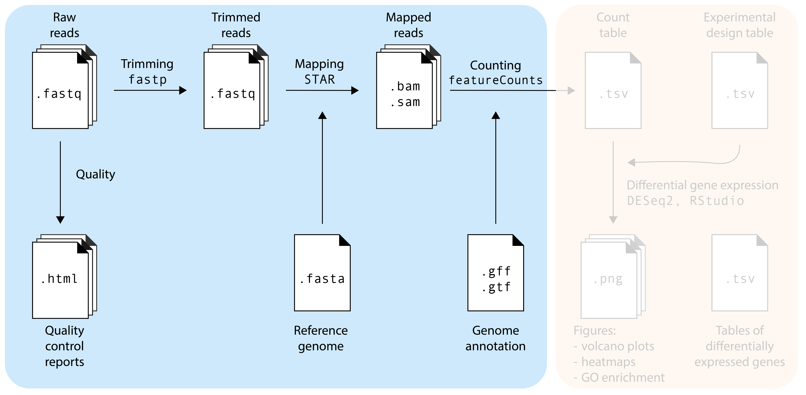
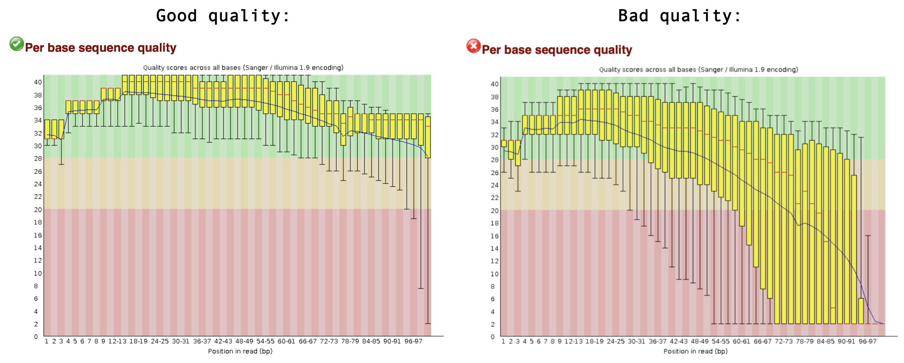
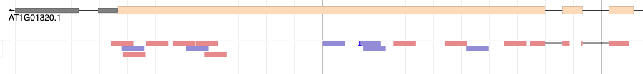

The moment is there: you received the FASTQ files from your sequencing provider! .... now what?

The `.fastq` files contain your RNA sequencing reads. Our goal is to find out from which genes these reads originate, and whether there are differentially expressed genes between your experimental factors. Before doing that, we need to make sure that the sequencing reads are of good quality, a process called quality control (QC). Additionally, no matter how good the overall quality of the sequencing data is, we will also 'trim' our reads to remove bad quality reads and sequencing adapters that may still be present in the sample. So, to summarize, we will do the following steps in this episode:d

1. Quality control: is my sequencing data of *good quality*?
2. Trimming: removing bad quality reads and sequencing adapters
3. Mapping: where in the genome do these reads come from? 
4. Counting: how many reach originate from each gene?

## Setup

For this tutorial, we again connect to the headnode of Crunchomics via Rstudio in the webbrowser. Go to: [https://omics-app01.science.uva.nl](https://omics-app01.science.uva.nl) and login. Then, in the terminal, login to the headnode:

```bash
ssh YOURSTUDENTNUMBER@omics-h0.science.uva.nl
```

Navigate to the MDA directory, and create a new directory for this tutorial:

```bash
cd personal/MDA/
mkdir RNA-seq
cd RNA-seq/
```

Create a directory to store the raw data, and download the reads that we will use:

```bash
mkdir data
cd data/

# download 4 read sets, move to subdirectory reads
wget https://github.com/mishapaauw/molecular-data-analysis/raw/refs/heads/main/part2-rna-seq/data/sample1.fastq.gz
wget https://github.com/mishapaauw/molecular-data-analysis/raw/refs/heads/main/part2-rna-seq/data/sample2.fastq.gz
wget https://github.com/mishapaauw/molecular-data-analysis/raw/refs/heads/main/part2-rna-seq/data/sample3.fastq.gz
wget https://github.com/mishapaauw/molecular-data-analysis/raw/refs/heads/main/part2-rna-seq/data/sample4.fastq.gz

mkdir reads
mv sample*.gz reads/

# download reference genome, move to subdirectory genome
wget https://github.com/mishapaauw/molecular-data-analysis/raw/refs/heads/main/part2-rna-seq/data/TAIR10.fasta.gz
wget https://github.com/mishapaauw/molecular-data-analysis/raw/refs/heads/main/part2-rna-seq/data/TAIR10_GFF3_genes.gff.gz

mkdir genome
mv TAIR10*.gz genome/
```

```bash
cd ..
pwd
```

Make sure your working directory is `rna-seq` again.

## Quality control: `fastqc`

The first step in the RNA-seq workflow is to assess the quality of the sequencing reads. Sequence reads generated from next-generation sequencing technologies come in the FASTQ file format. This file format evolved from FASTA: it contains sequence data, but also contains quality information. For a single record (sequence read) there are four lines, each of which are described below:

|Line|Description|
|----|-----------|
|1|Always begins with '@' and then information about the read|
|2|The actual DNA sequence|
|3|Always begins with a '+' and sometimes the same info in line 1|
|4|Has a string of characters which represent the quality scores; must have same number of characters as line 2|

Let's look at one read. Note that our `.fastq` files are compressed: they have extension `.fastq.gz`. Most bioinformatics programs can deal with compressed file, so we don't need to uncompress them. To have a look at a compressed file on the command line, we can use `zcat` and then pipe (`|`) the result into the `head` function to display the first 4 lines:

```{bash filename="bash"}
#| eval: false
zcat data/reads/sample1.fastq.gz | head -n 4

@ERR1406259.2 HWI-ST1034:108:D1HW4ACXX:1:1101:1627:2208/1
CCGAAACAATCTCTCTCTCGTCGCCGGAAGCAAAAGAAGAATTAAGATAAGCCTCATCCATCCAGTGATGCAAATCACCAACCCATATGGTTTTATTCTCA
+
CCCFFFFFHHHHHJJJIJJGIIIJJJFJJJJJJJIJIIGIIIJJJHIJJJHGHHHFFEFFFEDEEACDDDDDDDDDDDDDDDDDDDDDED4@BDDDDDEDC
```

The fourth line of each read represent the quality score of each basecall, see [Wikipedia](https://en.wikipedia.org/wiki/Phred_quality_score#Symbols) for more info. `fastqc` will use these characters to quantify the quality your read set.

Let's run `fastqc` on one sample:

```{bash filename="bash"}
#| eval: false
mkdir fastqc_reports # <1>
fastqc -o fastqc_reports data/reads/sample1.fastq.gz # <2>
```

1. First we make a directory (`mkdir`) to store the `fastqc` reports.
2. We call the `fastqc` program, tell it to store the output in the fastqc_reports directory, and tell it which sample to use.

You'll see that `fastqc` created a `.html` page in the `fastqc_reports` directory. We'll inspect it later.

::: {.callout-tip title="Exercise" icon="false"}
Run `fastqc` on another sample.
:::

::: {.callout-caution title="Solution" collapse="true" icon="false"}
To do this, we need to replace the input filename.

```{bash filename="bash"}
#| eval: false
fastqc -o fastqc_reports reads/sample2.fastq.gz
```
:::

Doing this manually for every sample would be quite tiring, especially when we would have many samples. We will use a for loop, a fundamental programming concept, to automate this process for us:

```{bash filename="bash"}
#| eval: false
for sample in data/reads/*.fastq.gz # <1>
do # <2>
  fastqc -o fastqc_reports ${sample} # <3>
done
```

1. Here we define a variable `sample` that will subsequently get the values of all datasets matching the `reads/*.fastq.gz` statement, where `*` acts as a wildcard.
2. `do` (and later `done`) define the start and the end of the for loop, respectively.
2. Here we add the actual command that will be repeated for each sample, where `$sample` will subsequently be filled in with all of our four filenames.

`fastq` generates reports of each sample in `.html` and `.zip` format:

```{bash filename="bash"}
#| eval: false
ls fastqc_reports # <1>

sample1_fastqc.html  sample2_fastqc.zip   sample4_fastqc.html
sample1_fastqc.zip   sample3_fastqc.html  sample4_fastqc.zip
sample2_fastqc.html  sample3_fastqc.zip
```
1. `ls` is a command to 'list' all the files present in a directory.

Finally, let's inspect the QC results. In Rstudio, go to the 'files' window. Navigate to the `MDA/rna-seq/` directory (by clicking, this time :) ). In the `fastqc_reports/` directory, you can click on any of the `.html` files and display it in your browser. Alternatively, you could download them to your local computer by clicking `More > Export`. `fastqc` gives each dataset a score (Pass, Warning, or Fail) on several different modules. All scores are reported in the **Summary**. The next section contains basic statistics like the number of reads, average sequence length, and the GC content. Generally it is a good idea to keep track of the total number of reads sequenced for each sample and to make sure the read length and GC content is as expected (based on what you know of your studied organism). One of the most important analysis modules is the **“Per base sequence quality”** plot. This plot provides the distribution of quality scores at each position in the read across all reads. This plot can alert us to whether there were any problems occuring during sequencing. For example, see a good and bad quality result below:



Other modules are discussed in detail [here](https://hbctraining.github.io/Intro-to-rnaseq-hpc-salmon/lessons/qc_fastqc_assessment.html). Note that nearly all sequencing datasets will show yellow warnings or red fails: `fastqc` is quite conservative. Additionally, the module "Per base sequence content" very often fails for RNA-seq data, as a result of RNA-seq library prep. Your experiment is not lost if you get warnings or fails, but it might warrant additional inspection of the reads. If you suspect something is wrong, don't hesitate to contact the sequencing provider or your favorite bioinformatician.

::: {.callout-tip title="Exercise" icon="false"}
Inspect all four QC reports, and discuss with your neighbour what you think about them.
:::

::: {.callout-caution title="Solution" collapse="true" icon="false"}

- Sample 1, 2 and 3 are actually of good quality. Only the expected module (Per base sequence content) gives a FAIL, all other modules are green!
- For sample 4 this is not the case. The quality score of the bases is low, especially towards the end of the reads. Also, `fastqc` detected a TruSeq sequencing adapter in a small portion of the reads.

:::

## Trimming: `fastp`

A common anomaly detected by `fastqc` is sequencing adapters still being present some of the the reads (shown in **Overrepresented sequences** table). This is known as 'adapter contamination', and the presence of these adapter sequences in the reads might affect how the reads map to the genome of interest. So, we need to get rid of them. We will use `fastp` to do this. In addition, `fastp` will trim low quality bases from the reads. Finally, it will remove reads that are overall of low quality, or are too short after the trimming steps.

```{bash filename="bash"}
#| eval: false
mkdir fastp_reports
mkdir data/trimmed_reads
fastp \ 
  -i data/reads/sample1.fastq.gz \
  -o data/trimmed_reads/sample1.trimmed.fastq.gz \
  --thread 2 \
  --html fastp_reports/sample1_fastp_report.html
```

`fastp` prints information about the trimming on the terminal, for example:

```{bash filename="partial output"}
#| eval: false
Filtering result:
reads passed filter: 39343
reads failed due to low quality: 10642
reads failed due to too many N: 15
reads failed due to too short: 0
reads with adapter trimmed: 0
bases trimmed due to adapters: 0
```

The same information is also saved as a nice `.html` page, you can download them and have a look.

::: {.callout-tip title="Exercise" icon="false"}
After running `fastp`, the adapter contamination of sample 4 should be gone.

1. How could you check whether `fastp` indeed did it's job?
2. Write a command to check this.
:::

::: {.callout-caution title="Solution" collapse="true" icon="false"}
1. We can run `fastqc` again, this time on the trimmed reads.
2. 
```{bash filename="bash"}
#| eval: false
fastqc -o fastqc_reports_trimmed trimmed_reads/sample4.trimmed.fastq.gz
```
By inspecting the `.html` report of the trimmed reads, we should see that the quality of the read sets has now improved, and that it no longer detects the TruSeq adapters.
:::

## Mapping: `STAR`

Our reads are now ready for mapping. Mapping reads means figuring out where each read from the RNA-seq experiment originally came from within the genome. For RNA-seq experiments, it's important to pick a **splice-aware** aligner, since a RNA-seq read can span an exon-intron-exon boundary. After all, the vast majority of RNA you sequenced is mature mRNA where introns have been spliced out. 

)](../images/spliced_alignment-2.png)

::: {.callout-tip title="Question" icon="false"}
So, for RNA-seq we need splice-aware aligners. Can you come up with an experiment that would not require a splice-aware aligner program?
:::

::: {.callout-caution title="Solution" collapse="true" icon="false"}
In experiments where we don't need to think about exon-intron boundaries. This is the case when the reads originate from genomic DNA, for example for whole genome sequencing experiments, or enrichment sequencing experiments like Chip-Seq. We also don't need a splice-aware aligner if we map RNA-seq reads from organisms that don't have introns, such as bacteria.
:::

To use an alignment tool, we must first get the **reference genome** (e.g. via [NCBI Genomes](https://www.ncbi.nlm.nih.gov/datasets/genome/), [ENSEMBL](https://www.ensembl.org/info/data/ftp/index.html), [ENSEMBL Plants](https://plants.ensembl.org/info/data/ftp/index.html) or various organism specific databases), in `.fa` or `.fasta` format. A genome assembly contains the entire genome sequence of an organism as plain text, organized by chromosome (for 'high-quality' assemblies) or many some unplaced contigs (for 'draft' genomes). You will also need an annotation file with all the predicted gene models (`.gff` or `.gtf`format). For this tutorial, the *A. thaliana* reference genome and annotation are included in the workshop materials. 

Let's have a quick look at the reference genome, after uncompressing them first:

```{bash filename="bash"}
#| eval: false
gunzip data/genome/TAIR10.fasta.gz 
gunzip data/genome/TAIR10_GFF3_genes.gff.gz 

# Inspect
head data/genome/TAIR10.fasta # <1>
>1 dna:chromosome chromosome:TAIR10:1:1:30427671:1 REF
CCCTAAACCCTAAACCCTAAACCCTAAACCTCTGAATCCTTAATCCCTAAATCCCTAAAT
CTTTAAATCCTACATCCATGAATCCCTAAATACCTAATTCCCTAAACCCGAAACCGGTTT (...)

grep ">" data/genome/TAIR10.fasta # <2>
>1 dna:chromosome chromosome:TAIR10:1:1:30427671:1 REF
>2 dna:chromosome chromosome:TAIR10:2:1:19698289:1 REF
>3 dna:chromosome chromosome:TAIR10:3:1:23459830:1 REF
>4 dna:chromosome chromosome:TAIR10:4:1:18585056:1 REF
>5 dna:chromosome chromosome:TAIR10:5:1:26975502:1 REF
>Mt dna:chromosome chromosome:TAIR10:Mt:1:366924:1 REF
>Pt dna:chromosome chromosome:TAIR10:Pt:1:154478:1 REF
```

1. Look at the first 10 lines: a fasta header starting with `>`, chromosome number, and some metadata. Then, the sequence of that chromosome starts.
2. Search for the character `>`, which is an essential part of a fasta sequence header. We then see a list of chromosomes included in this genome assembly.

Ok, our Arabidopsis genome assemblies contains 5 chromosomes, and the genomes of the organelles: mitochondria (`Mt`) and plastid (`Pt`).

Before we start mapping we need to *index* the reference genome. Indexing the genome prepares the genome in a way that allows a computer to search it efficiently. The genome, a multi-million basepair long string of text, is encoded into a different, computer-friendly datastructure such as a suffix tree. The details of this procedure are beyond the scope of this tutorial, but it's important to do it. The *Arabidopsis thaliana* genome is already present in the notebook. We make the index using `STAR`:

```{bash filename="bash"}
#| eval: false
STAR --runMode genomeGenerate \
  --genomeSAindexNbases 12 \
  --genomeFastaFiles genome/TAIR10.fasta \
  --genomeDir TAIR10_STAR_index
```

Allright, let's finally run `STAR`. This tool requires quite some parameters to be set: 

- How many threads to use (`--runThreadN`)
- Where to find the index (`--genomeDir`)
- Ehere to find the reads (`--readFilesIn`)
- That the reads are compressed (`--readFilesCommand`)
- Where to store the results (`--outFileNamePrefix`)
- And which output file format we want (`--outSAMtype`)

```{bash filename="bash"}
#| eval: false
STAR \   
  --runThreadN 2 \ 
  --genomeDir TAIR10_STAR_index \
  --readFilesIn trimmed_reads/sample1.trimmed.fastq.gz \
  --readFilesCommand zcat \
  --outFileNamePrefix mapped_reads/sample1_ \
  --outSAMtype BAM SortedByCoordinate
```

Let's look at a mapping summary in a file generated by STAR that ends with `.final.out`. We can do that on the command line (using `cat`), or you can download the file and open it in a text editor. 

```{bash filename="bash"}
#| eval: false
cat mapped_reads/sample1_Log.final.out
```

It's important to check how many reads did not map to the reference genome. In our case, it looks like more than 95% of the reads mapped to the reference genome. That's good! A high proportion of unmapped reads can be a warning sign that something went wrong in your experiment or analysis. The explanations may be technical (bad read quality), bioinformatical (perhaps you used the wrong reference genome!), or biological --- it has been well documented that around 11% of primate and rodent cell-line RNA-seq datasets available on NCBI in 2015 were contaminated with mycoplasma RNA ([Olarerin-George & Hogenesch, 2015](https://pmc.ncbi.nlm.nih.gov/articles/PMC4357728/)). Likewise, 8,5% of all *Arabidopsis thaliana* NCBI RNA-seq datasets are contaminated with a virus that does not cause any disease symptoms, but can cover up to 80% of all reads generated in an RNA-seq experiment ([Verhoeven et al., 2022](https://nph.onlinelibrary.wiley.com/doi/full/10.1111/nph.18466)). That said, we don't need to aim for 100% reads mapped to the reference genome. There will always be some contamination, or your studied individual possesses genetic information not present in the reference genome. 

### BAM and SAM files

The mapped reads are stored in a sorted `.bam` file by `STAR`. `.sam` (and `.bam`) files keep information for each individual read and its alignment to the genome. `.sam` files do this in a tab-seperated, human readable format, while `.bam` files store the same information in a binary file format that's not readable for humans, but is much more efficient to process and store by computers. `samtools` is a widely used program to inspect and manipulate `.sam` and `.bam` files. Like many command line programs, `samtools` commands can be connected to each other via the pipe symbol `|`, and the results can be stored in a new file using the `>` symbol. 

::: {.callout-tip title="Exercise" icon="false"}
Use the `head` command to inspect a `.bam` file. 

1. What do you see?
2. Use `samtools view` command, piped (using `|`) into a common Unix program, to inspect the first 10 lines of the file. 
:::

::: {.callout-caution title="Solution" collapse="true" icon="false"}

1. 
```{bash filename="bash"}
#| eval: false
head mapped_reads/sample1_Aligned.sortedByCoord.out.bam
```

The output looks like gibberish, because `.bam` files are a binary file format. 

2. You can use `samtools view` to make samtools read the binary file, and then pipe that result into the `head` function to show the first 10 lines:

```{bash filename="bash"}
#| eval: false
samtools view mapped_reads/sample1_Aligned.sortedByCoord.out.bam | head
```
:::

::: {.callout-tip title="Exercise" icon="false"}
Use the two following commands on a `.bam` file, and interpret the output.

1. `samtools flagstat`
2. `samtools idxstats` (Note: before running this command, you need to index the `.bam` file using `samtools index mapped_reads/sample1_Aligned.sortedByCoord.out.bam`) 
:::

::: {.callout-caution title="Solution" collapse="true" icon="false"}

1. `samtools flagstat` shows us (just like the `STAR` log file) how many reads were mapped correctly. In addition, it tells us whether read pairs (if mapping paired-end data) mapped together as expected (are 'properly paired'). Today, we used single-end reads so this is not relevant.
2. `samtools idxstats` shows us how many reads were mapped to each chromosome of the reference genome. This is useful to confirm whether the entire genome is evenly covered, or that there may be overrepresentation on e.g. the mitochondrial DNA.
:::

::: {.callout-tip title="Exercise" icon="false"}
So far, we only trimmed and mapped one sample. Trim and map the other three samples. Easy mode: repeat the commands performed earlier, update the sample numbers. For a challenge: write two `bash` for loops to process all four samples.
:::

::: {.callout-caution title="Solution" collapse="true" icon="false"}

1. For loop to trim:

```{bash filename="bash"}
#| eval: false
for sample in reads/*.fastq.gz
do
  name=$(basename "$sample" .fastq.gz)
  echo "processing ${name}"

  fastp \
  -i reads/${name}.fastq.gz \
  -o trimmed_reads/${name}.trimmed.fastq.gz \
  --thread 2 \
  --html fastp_reports/${name}_fastp_report.html
done
```

Note the use of `name=$(basename "$sample" .fastq.gz)`: this is a trick to remove the file extension (`.fastq.gz`) and the folder structure `reads/` from the filenames, resulting in just the sample names e.g. `sample1`.

2. For loop to map:

```{bash filename="bash"}
#| eval: false
for sample in trimmed_reads/*.trimmed.fastq.gz
do
  name=$(basename "$sample" .trimmed.fastq.gz)

  software/STAR \
    --runThreadN 2 \
    --genomeDir TAIR10_STAR_index \
    --readFilesIn trimmed_reads/${name}.trimmed.fastq.gz \
    --readFilesCommand zcat \
    --outFileNamePrefix mapped_reads/${name}_ \
    --outSAMtype BAM SortedByCoordinate
done
```
:::

### Inspecting the mapping on a genome browser

So far, these steps may have been quite abstract. Let's make it more visual. We will look at our mapped reads in a genome browser. 

1. Download a `.bam` file with accompanying `.bam.bai` index file.
2. Go to [the Arabidopsis page on Phytozome](https://phytozome-next.jgi.doe.gov/info/Athaliana_TAIR10)
3. Click `JBrowse`.
4. Go to `File` > `Open track file or URL` > `Select Files...` to find your files.
5. Click `Open`!



That's wonderful! You should see red and blue (forward and reverse) blocks aligning with the exons of the annotated gene models of *A. thaliana*. Also notice that some reads will be beautifully split over two or more introns. Good RNA-seq mapping should align predominantly to exons. If this is not the case, something might be wrong. For example, your RNA sample could have been contaminated with genomic DNA. Another option that could explain mappings to non-annotated regions of the genome, is that the annotation may not be complete. 

::: {.callout-note}
An alternative genome browser that can display `.bam` files is [IGV](https://igv.org). In IGV the genomes of many model organisms are available, but you can also upload your own genome of interest.
:::

Obviously, we can't manually inspect all samples and all genes like this, so we will need to count the number of reads in each in gene in each sample. We will do that in the next and final step of today.

## Counting: `featureCounts`

The `featureCounts` program will .... count (!) the number of reads that map within an annotated feature. To do this we need the `.gff` or `.gtf` gene annotation files. These files contain numerous rows with `chromosome`, `start` and `end` coordinates of all annotated features (e.g. genes!). Here, we chose to aggregate read count by gene (`-t gene`). Alternative options are transcript and exon (but they may require a different formatting of the annotation file).

```{bash filename="bash"}
#| eval: false
featureCounts \
  -T 2 \
  -O \
  -a genome/TAIR10_GFF3_genes.gff \
  -o counts.tsv \
  -t gene \
  mapped_reads/*.bam
```

While running, `featureCounts` shows how many mapped reads were assigned to features. Finally, let's look at the counts table that was generated:

```{bash filename="bash"}
#| eval: false
head counts.tsv

# Program:featureCounts v2.0.3; Command:"featureCounts" "-T" "2" "-O" "-a" "genome/TAIR10_GFF3_genes.gff" "-o" "raw_counts.tsv" "-t" "gene" "mapped_reads/sample1_Aligned.sortedByCoord.out.bam" "mapped_reads/sample2_Aligned.sortedByCoord.out.bam" "mapped_reads/sample3_Aligned.sortedByCoord.out.bam" "mapped_reads/sample4_Aligned.sortedByCoord.out.bam" 
Geneid	Chr	Start	End	Strand	Length	mapped_reads/sample1_Aligned.sortedByCoord.out.bam	mapped_reads/sample2_Aligned.sortedByCoord.out.bam	mapped_reads/sample3_Aligned.sortedByCoord.out.bam	mapped_reads/sample4_Aligned.sortedByCoord.out.bam
AT1G01010	1	3631	5899	+	2269	0	0	0	0
AT1G01020	1	5928	8737	-	2810	0	0	2	0
AT1G01030	1	11649	13714	-	2066	0	0	0	0
AT1G01040	1	23146	31227	+	8082	5	5	3	1
AT1G01046	1	28500	28706	+	207	0	0	0	0
AT1G01050	1	31170	33153	-	1984	3	6	4	0
AT1G01060	1	33379	37871	-	4493	1	2	2	0
AT1G01070	1	38752	40944	-	2193	1	0	0	0
```

The first row records the specific `featureCounts` command that we used to make this table. Ech subsequent row corresponds to a `Geneid`. The first six columns provide gene metadata: `geneid`, `chromosome`, `start` and `end` coordinates, `strand`, and `gene length`. All remaining columns contain the read counts of each sample.

::: {.callout-note}
To use the `featureCounts` table with `DESeq2`, you will need to clean it. First, we don't need the header that starts with `#`. Second, we only need the `geneid` and count columns, nothing else. Third, the sample names should be cleaned from `mapped_reads/sample1_Aligned.sortedByCoord.out.bam` to just `sample1`.

You can do this in many ways. It's possible in `R`, after loading the data, but before starting `DESeq`. It's possible to do this by hand in `Excel`. Finally, you can do it with a number of `unix` commands on the command line:

```bash
grep -v '#' counts.tsv | cut -f1,7- | sed 's/_Aligned.sortedByCoord.out.bam//g'| sed 's|mapped_reads/||g' | column -t > counts_cleaned.tsv
```
:::

## A note on the specific tools used here

In bioinformatics, there are often many ways to reach the same goal. Here we have selected mapping, trimming and counting tools that we have available and have experience with, but there are many others that perform just as well. The following table highlights a few popular alternative options:

| Task | Tool used here | Alternative tools |
| ---- | -------------- | ----------------- |
| Trimming | `fastp` | `cutadapt`, `trimmomatic` |
| Mapping | `STAR` | `HISAT2` |
| Counting | `featureCounts` | `StringTie` |

Instead of real base-to-base read mapping using `STAR` or `HISAT2`, you can also consider *quasi-mapping* your reads to just the annotated transcript models using `salmon`. This is much faster and requires less storage space than real mapping, but for educational purposes and smaller scale experiments, true mapping is still more insightful. 

## Streamlining read mapping procedure

If you find this process quite cumbersome, then I have good news for you! There are *pipelines* available that streamline the chain of commands required for mapping:

- [snakemake_rnaseq](https://github.com/BleekerLab/snakemake_rnaseq): developed at the Bleeker Lab (UvA).
- [nf-core/rnaseq](https://nf-co.re/rnaseq/3.19.0): developed and maintained by the Nextflow community.
- Galaxy server: if you prefer graphical interfaces over command lines, you can contact Frans van der Kloet for access to a Galaxy Server (for UvA/SILS researchers).

A full instruction of these pipelines is beyond the scope of this workshop. Also, we wish to highlight that it is *very insightful* to have run all the steps by yourself rather than in a pipeline.